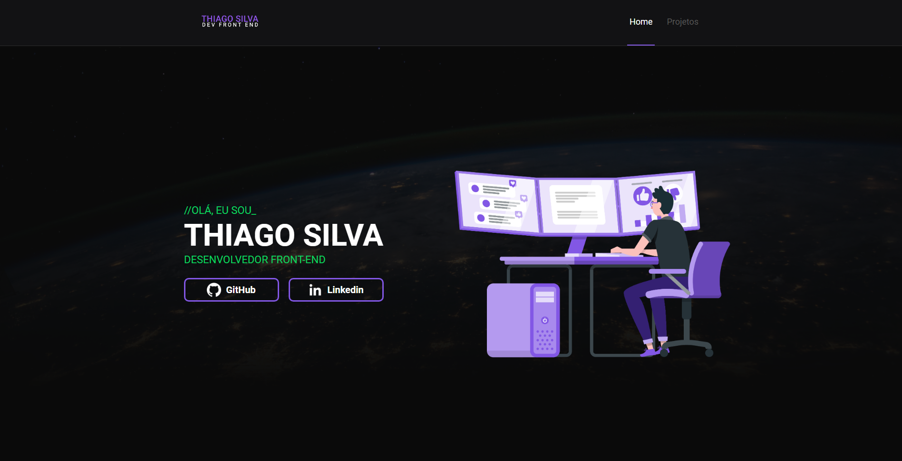

#  **Personal Portfolio**

## 	&#127919; **About**
Esse é o Projéto do meu Portfolio pessoal, aqui tem informações sobre mim e meus projetos.

## 📋**My Experience**
Essa foi uma das melhores expoeriências que tive, foi um desafio imaginar esse projéto tanto em código quanto em layout, serviu muito para aprofundar a base de conhecimento em React e Typescript.

## 🔧 **Techs**

* HTML
* CSS
* JavaScript
* TypeScript
* React
* Styled-Components
* React Router Dom

## &#127775; **Features**
&#10004; Rotas Personalizadas &#10004; Componentes Reutilizaveis &#10004; Seção de projétos adaptada para adicionar um novo projéto com base em um arquivo externo &#10004; Layout Confortável

## <a href="https://thiagosilvaportfolio.vercel.app/">**Clique aqui para visitar o Projéto**</a>

